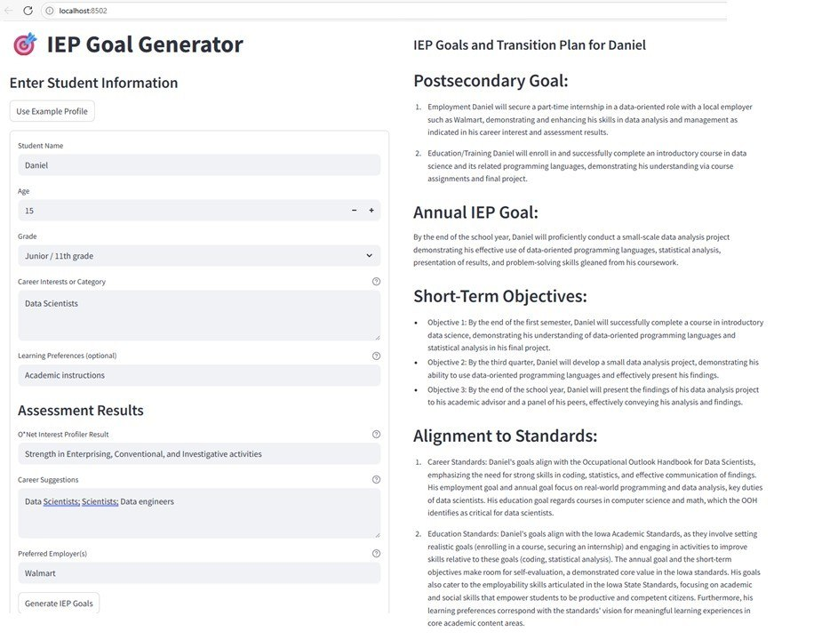

### About

RAG IEP Goal Generator (or rag_iep_gen) is an application that leverages Retrieval Augmented Generation to generate Individualized Education Program (IEP) goals for students with disabilities that align with industry standards and educational frameworks.
It is availble both as a python executable and as a Streamlit application, which can be easil deployed.

This is a mini ~~capstone~~ project for the [End-to-End Natural Language Processing](https://trac-ai.iastate.edu/event/end-to-end-natural-language-processing-2/) course from [Iowa State Univerity's Translational AI Center](https://trac-ai.iastate.edu/).

### Setup

**rag_iep_gen requires** a system that preferrably has a GPU processor for fast computation. To install it, please follow the steps below:
1. Create a conda environment "rag_iep_gen" by running  *conda create -n rag_iep_gen python=3.10*
2. Activate the environment: *conda activate rag_iep_gen*
3. Install the required packages: *pip install -r requirements.txt*
4. To launch the streamlit app, run *python -m streamlit run app.py*

### Usage

The system takes student information (including assessment results, interests, O*Net Interest Profiler assessment, and needs) as input and generate appropriate measurable postsecondary goals and short-term objectives that are aligned with both industry standards and state educational content standards. The retrieval leverages a FAISS vectorstore that was generated using information extracted from the documents in the data/ folder.

**To use the Streamlit App:**
 - Enter the student profile information as instructed on the form (or click the 'Use Example Profile' button, to automatically fill out the form with the information for a student name Clarence).
 - Submit the information by clicking the 'Generate IEP Goals' button

See Figure below.

#### Demo
To explain how the application works in the brackground, a **Jupyter Notebook is provided**, and available [here](my_iep_goal_generator_test.ipynb). Feel free to play around by changing the input.

The demo also:
 - illustrates different functionalities,
 - highlights **strengths and weaknesses** of the approach
 - provides an **assessment of the output**, using various metrics and approaches,
 - highlights some challenges encountered.

### Important notes

For demonstration purposes:
   1. We have only included documents relevant for a limited number of career profiles, incl. 'retail salesperson', 'driver/sales worker'.
   2. The content only follows the education standards from the state of IOWA. Minor updates can be made to accomodate for other states.

 

